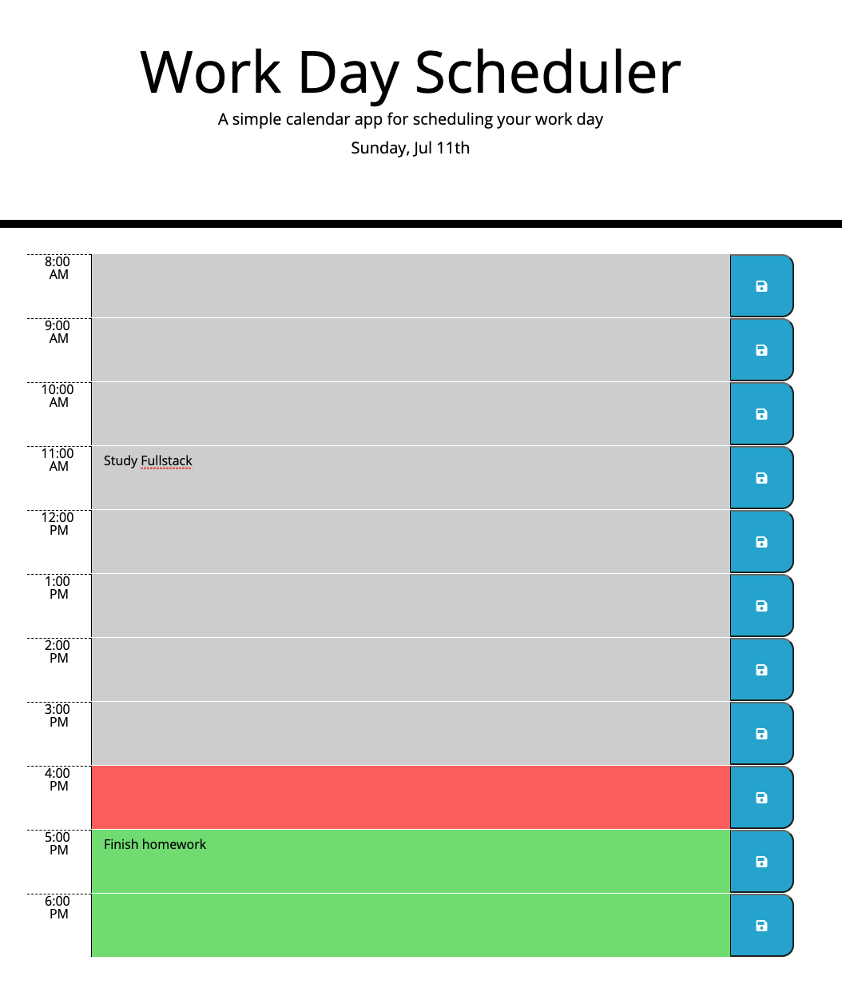

# PlanYourDay
a work day planner application

## Functionality 
The app will present the user with 1-hour blocks. Each block will show the corresponding hour, a text area, and a save button. Each Text area will be highlighted as following: 

- Red to indicate current hour
- Grey to indicate past hour(s)
- Green to indicate future hour(s)

A user can enter text into the text area and press the save button. Saved text will reload upon refresh. The user must press the save button that corresponds to the text area in order to save the updates. 

## Technologies Used

* moment.js to manipulate the time
* jQuery to add elements
* local storage to store text area inputs
* bootstrap to style the document

## Assets And Scripts
* style.css CSS file 
* script.js JavaScript to mainpulate and add the elements

## How to access
Use [Day Planner](https://rashir01.github.io/MyDayPlanner/) to access the day planner

## Screenshots

---

© 2021 Ray Ashir